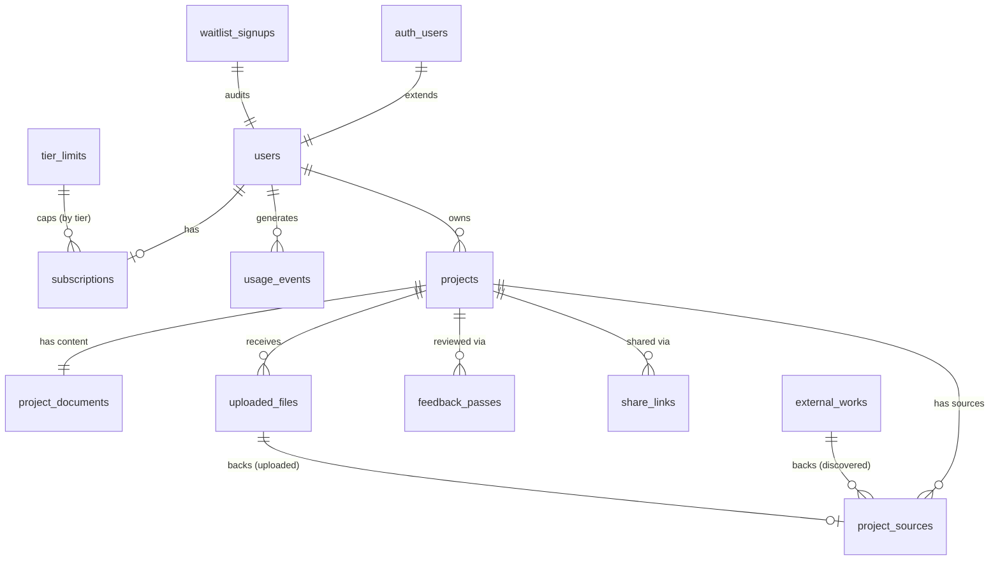

# Alvus AI — Data Model

Postgres via Supabase, schema owned by Drizzle ORM (`db/schema/*.ts`); `supabase-js`
stays scoped to Auth and Storage, never used to read/write app tables directly.
`auth.users` is the identity root — `users` is a 1:1 profile extension.

## ER overview

## `waitlist_signups`
Admin-facing audit/queue record, not a pre-account gate — `users`/`auth.users` are
created immediately at signup (same transaction), per the intake's "accounts sit
pending until approved" flow. This table's `status` mirrors `users.status` (both
written by the same admin approve/reject handler); `users.status` is what the Hono
middleware actually checks per-request.
| Field | Type | Notes |
|---|---|---|
| `id` | uuid PK | |
| `user_id` | uuid, unique, not null, FK → `users.id` ON DELETE CASCADE | |
| `email` | text, not null | denormalized for admin queue view |
| `status` | text, default `pending` | enum: `pending`\|`approved`\|`rejected` |
| `requested_at` / `reviewed_at` | timestamptz | |
| `reviewed_by` | uuid → `users.id` | |
| `notes` | text, nullable | admin-only |

Indexes: unique `user_id`; index `status` (admin queue `WHERE status='pending'`).
Sensitive: `email` (PII), admin-only read.

## `users`
Created immediately at signup (same transaction as `auth.users` and the
`waitlist_signups` row) — approval gates access, not account existence.
| Field | Type | Notes |
|---|---|---|
| `id` | uuid PK, FK → `auth.users.id` ON DELETE CASCADE | |
| `email` | text, not null | synced from `auth.users` |
| `display_name` | text, nullable | |
| `status` | text, default `pending` | enum: `pending`\|`approved`\|`rejected` — checked by middleware on **every** request except `GET /auth/me`/`POST /auth/logout`; only an admin action changes it |
| `role` | text, default `member` | enum: `member`\|`admin` |
| `created_at` / `updated_at` | timestamptz | |

Indexes: PK `id`; index `role`. No index on `status` (read via PK lookup, never
filtered directly). Sensitive: `email` (PII), self + admin only.

## `subscriptions`
1:1 current billing state per user; Stripe is the historical ledger.
| Field | Type | Notes |
|---|---|---|
| `id` | uuid PK | |
| `user_id` | uuid, unique, FK → `users.id` ON DELETE CASCADE | |
| `tier` | text, default `free` | enum: `free`\|`plus`\|`pro`; validated against `tier_limits.tier` at app layer |
| `stripe_customer_id` / `stripe_subscription_id` | text, nullable, unique | |
| `status` | text, nullable | mirrors Stripe: `active`\|`trialing`\|`past_due`\|`canceled`\|`incomplete` |
| `current_period_start` / `current_period_end` | timestamptz, nullable | from webhook |
| `cancel_at_period_end` | boolean, default `false` | |
| `created_at` / `updated_at` | timestamptz | |

Indexes: unique `user_id`, `stripe_customer_id`, `stripe_subscription_id` (webhook lookup key).
Sensitive: restrict to self + admin/service role.

## `tier_limits`
Config table, seeded not migrated with app data.
| Field | Type | Notes |
|---|---|---|
| `tier` | text | composite PK part; enum: `free`\|`plus`\|`pro` |
| `action_type` | text | composite PK part; enum: `source_analysis`\|`feedback_pass` |
| `monthly_limit` | integer, nullable | null = unlimited (no v1 tier uses this) |

PK: `(tier, action_type)`.

**v1 catalog** (seed data, tunable without a schema change):

| Tier | Price | `source_analysis`/mo | `feedback_pass`/mo |
|---|---|---|---|
| `free` | $0 | 5 | 3 |
| `plus` | $9 | 60 | 30 |
| `pro` | $24 | 250 | 120 |

Stripe Price IDs for `plus`/`pro` are env config (`STRIPE_PRICE_ID_PLUS`,
`STRIPE_PRICE_ID_PRO`), not stored in this table.

## `usage_events`
Append-only log backing limits and internal cost tracking. Limits enforced by summing
over a billing period at read time, not a mutable counter.
| Field | Type | Notes |
|---|---|---|
| `id` | uuid PK | |
| `user_id` | uuid, FK → `users.id` | |
| `project_id` | uuid, nullable, FK → `projects.id` ON DELETE SET NULL | |
| `action_type` | text | enum: `source_analysis`\|`feedback_pass` |
| `quantity` | integer, default `1` | |
| `token_cost_input` / `token_cost_output` | integer, nullable | LiteLLM-reported tokens |
| `billing_period` | date, not null | first-of-month UTC, calendar-month for all tiers |
| `metadata` | jsonb, nullable | model/latency, non-limit-relevant |
| `created_at` | timestamptz | |

Indexes: composite `(user_id, billing_period, action_type)` for the limit-check query;
index `created_at` for retention. Sensitive: billing-relevant, self + admin/service role.

## `projects`
| Field | Type | Notes |
|---|---|---|
| `id` | uuid PK | |
| `owner_id` | uuid, FK → `users.id` ON DELETE CASCADE | |
| `title` | text, not null | |
| `citation_format` | text, not null | enum: `mla`\|`apa`\|`chicago`, immutable after creation |
| `status` | text, default `draft` | enum: `draft`\|`in_progress`\|`completed`\|`archived` |
| `created_at` / `updated_at` | timestamptz | metadata changes only, not content |

Indexes: `owner_id`, `status`, `updated_at`. Sensitive: title + row existence private
to owner + valid share-link holder — RLS-enforced.

## `project_documents`
1:1 with `projects`, split out for write-frequency/payload-size.
| Field | Type | Notes |
|---|---|---|
| `project_id` | uuid PK, FK → `projects.id` ON DELETE CASCADE | not a surrogate key |
| `content` | jsonb, default `{}` | TipTap/ProseMirror JSON; in-text citation nodes reference `project_sources.id` |
| `content_version` | integer, default `1` | optimistic-concurrency check on autosave |
| `updated_at` | timestamptz | bumped every autosave |

Sensitive: most sensitive column in the schema — RLS owner + share-link read-only.

## `external_works`
Cross-project/cross-user cache of discovered bibliographic metadata, deduped by DOI.
| Field | Type | Notes |
|---|---|---|
| `id` | uuid PK | |
| `doi` | text, unique partial (`WHERE doi IS NOT NULL`) | primary dedup key |
| `semantic_scholar_id` | text, unique, nullable | secondary dedup key |
| `title` | text, not null | |
| `authors` | jsonb, default `[]` | |
| `abstract` | text, nullable | |
| `publication_year` | integer, nullable | |
| `venue` | text, nullable | |
| `external_ids` | jsonb, nullable | arXiv/PubMed/etc. |
| `oa_status` | text, nullable | `gold`\|`green`\|`hybrid`\|`bronze`\|`closed` |
| `oa_url` | text, nullable | |
| `full_text_fetched` | boolean, default `false` | |
| `full_text_storage_path` | text, nullable | Supabase Storage path; full text never stored inline in Postgres |
| `last_refreshed_at` | timestamptz, nullable | |
| `created_at` | timestamptz | |

Indexes: unique partial `doi`; unique `semantic_scholar_id`. Not sensitive — public
metadata, writes restricted to service role only.

## `uploaded_files`
| Field | Type | Notes |
|---|---|---|
| `id` | uuid PK | |
| `project_id` | uuid, FK → `projects.id` ON DELETE CASCADE | |
| `owner_id` | uuid, FK → `users.id` | denormalized for direct RLS checks |
| `storage_bucket` | text, default `source-uploads` | |
| `storage_path` | text, unique, not null | |
| `original_filename` | text, not null | |
| `mime_type` | text, not null | CHECK `IN ('application/pdf','text/plain')` |
| `file_size_bytes` | integer, not null | CHECK `<= <max, e.g. 20_000_000>` |
| `checksum_sha256` | text, nullable | dedup/integrity |
| `upload_status` | text, default `pending` | enum: `pending`\|`processed`\|`failed` |
| `created_at` | timestamptz | |

Indexes: `project_id`, `owner_id`. Sensitive: private source material — RLS on row +
Storage bucket policy keyed on `owner_id`/`project_id`.

## `project_sources`
Core entity joining discovery/upload, AI analysis, and bibliography selection. Exactly
one of `external_work_id`/`uploaded_file_id` set, matching `origin`.
| Field | Type | Notes |
|---|---|---|
| `id` | uuid PK | |
| `project_id` | uuid, FK → `projects.id` ON DELETE CASCADE | |
| `origin` | text, not null | enum: `discovered`\|`uploaded` |
| `external_work_id` | uuid, nullable, FK → `external_works.id` | set iff `origin='discovered'` |
| `uploaded_file_id` | uuid, nullable, FK → `uploaded_files.id` | set iff `origin='uploaded'` |
| `state` | text, default `candidate` | enum: `candidate`\|`selected`\|`rejected` — candidate=surfaced not chosen, selected=in bibliography, rejected=dismissed (kept, not re-suggested) |
| `citation_string` | text, nullable | generated once `state='selected'` |
| `strengths_summary` / `weaknesses_summary` | text, nullable | AI-generated |
| `usefulness_score` | numeric(4,2), nullable | AI-generated |
| `key_quotes` | jsonb, default `[]` | `{quote, location, usage_suggestion}[]` |
| `full_text_available` | boolean, default `false` | |
| `full_text_source` | text, nullable | enum: `open_access`\|`uploaded`\|`abstract_only` |
| `analyzed_at` / `selected_at` | timestamptz, nullable | |
| `created_at` / `updated_at` | timestamptz | |

Constraint: `CHECK` origin/foreign-key pairing (exactly one FK set per origin).
Indexes: `project_id`; composite `(project_id, state)`; `external_work_id`,
`uploaded_file_id`. Sensitive: analysis fields + citation string share the project's
RLS boundary even though `external_works` itself is public.

## `feedback_passes`
Post-writing comment-style feedback output (`POST/GET
/projects/:projectId/document/feedback`). One row per requested pass, not just latest.
| Field | Type | Notes |
|---|---|---|
| `id` | uuid PK | |
| `project_id` | uuid, FK → `projects.id` ON DELETE CASCADE | |
| `comments` | jsonb, default `[]` | `{id, anchor: {from,to}, category, text}[]`; anchor not re-validated against later edits (acceptable v1 limitation) |
| `created_at` | timestamptz | |

Indexes: `(project_id, created_at)`. Sensitive: same RLS boundary as
`project_documents` (derived from private content).

## `share_links`
| Field | Type | Notes |
|---|---|---|
| `id` | uuid PK | |
| `project_id` | uuid, FK → `projects.id` ON DELETE CASCADE | |
| `token_hash` | text, unique, not null | hash only, plaintext shown once at creation |
| `created_by` | uuid, FK → `users.id` | |
| `created_at` / `expires_at` / `revoked_at` | timestamptz, nullable except created_at | expiry and revocation are distinct |
| `last_accessed_at` | timestamptz, nullable | |
| `access_count` | integer, default `0` | |

Indexes: unique `token_hash`; `project_id`. Sensitive: `token_hash` is
credential-equivalent — long, cryptographically random, never logged in plaintext.

## Migration strategy

- Schema-as-code in `db/schema/*.ts`; `drizzle-kit generate` → committed SQL migrations
  in `db/migrations/` as source of truth.
- Local dev: `drizzle-kit push` for fast iteration. CI/shared envs: `drizzle-kit
  migrate` against the generated files (or mirrored via `supabase db push` — settled in
  the infra doc) for reproducible history.
- RLS policies are hand-written SQL migrations (not modeled in Drizzle's schema DSL);
  which tables need RLS is flagged per-entity above, policies themselves are the
  security doc's job.
- `db/seed.ts` (guarded to local/dev `DATABASE_URL` only) seeds: full `tier_limits`
  matrix (needed in every env including CI), a few fake `users` (member + admin), and
  sample `projects`/`project_documents`/`project_sources` across
  candidate/selected/rejected states so the UI renders without live API calls.

## Sensitivity summary

| Table | Sensitive columns/rows | Why |
|---|---|---|
| `waitlist_signups` | `email` | PII |
| `users` | `email` | PII |
| `subscriptions` | entire row | billing, cross-user leak risk |
| `usage_events` | entire row | billing-relevant |
| `projects` | `title`, row existence | private by default |
| `project_documents` | `content` | the paper itself |
| `uploaded_files` | entire row + Storage object | private source material |
| `project_sources` | summaries, quotes, citation | derived from private context |
| `feedback_passes` | `comments` | derived from private document content |
| `share_links` | `token_hash` | credential-equivalent |
| `external_works` | none | public metadata |
| `tier_limits` | none | public config |
