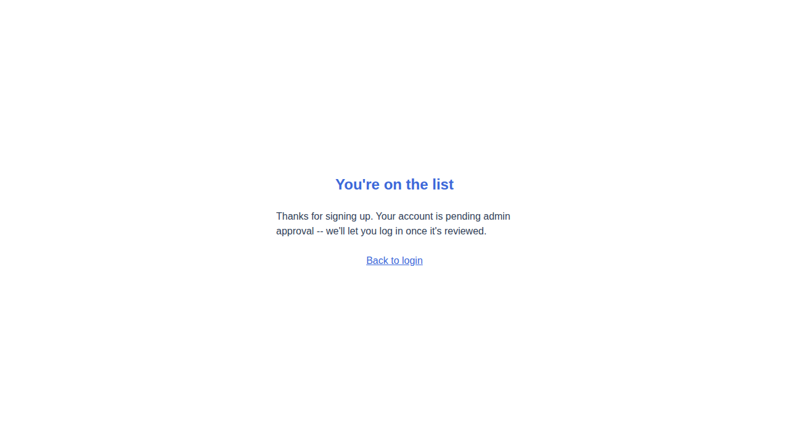
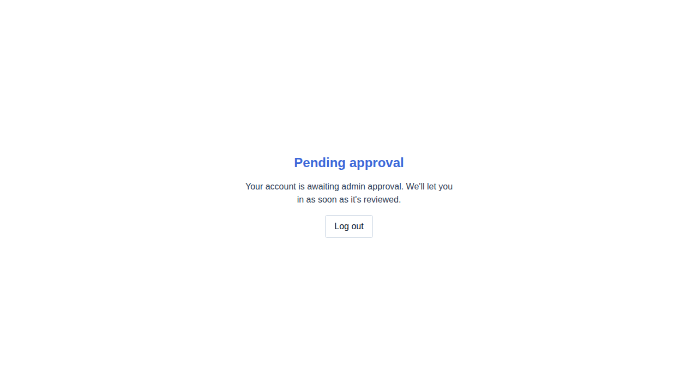
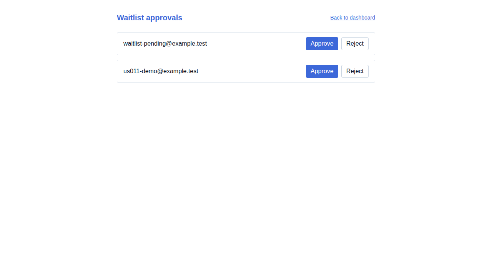
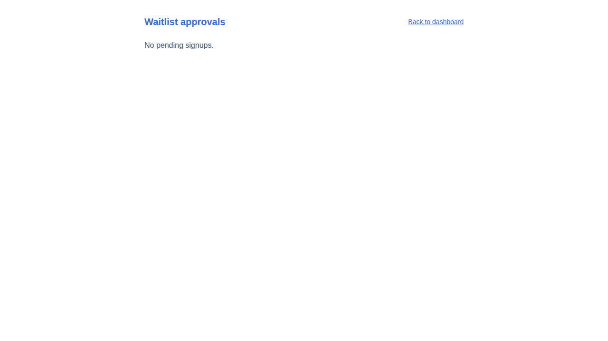
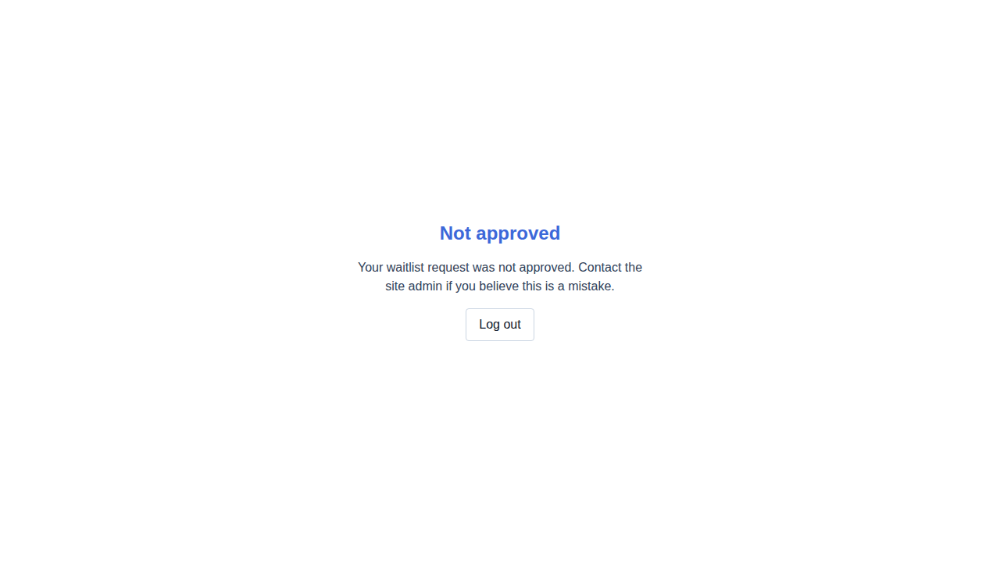
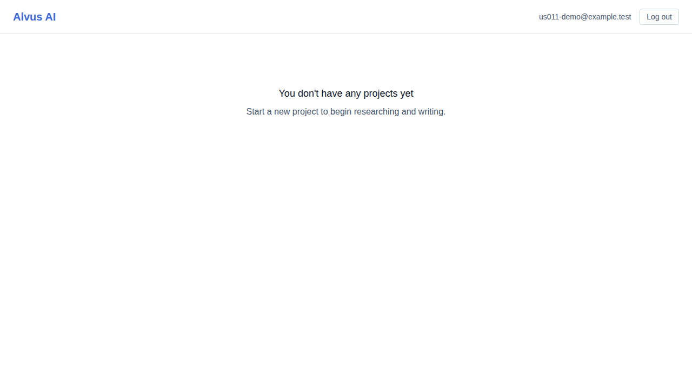
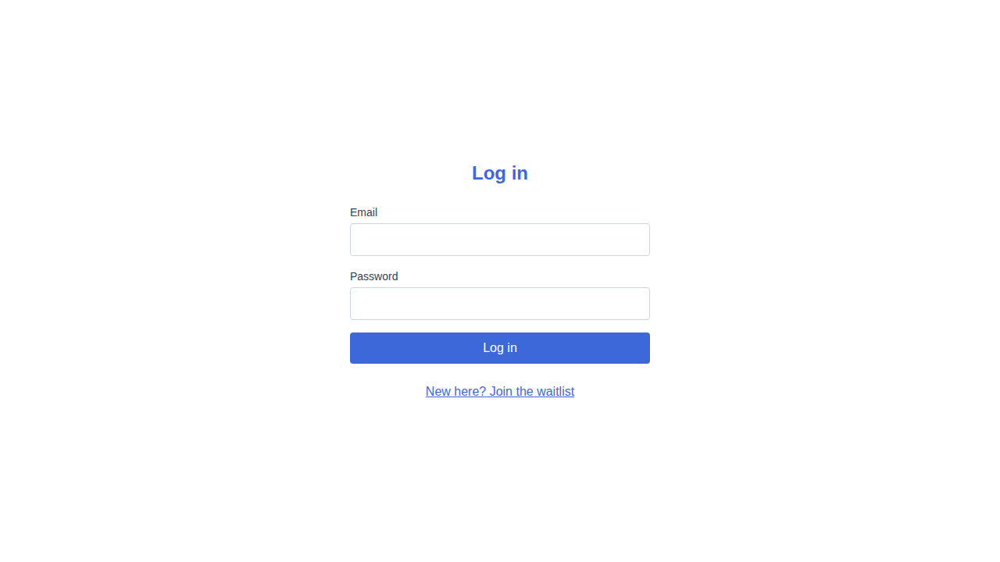

# US-011 — waitlist signup, admin approval, and login

_Generated from this story's spec · 2026-08-09 · PASS_

## 1. A visitor submits the waitlist signup form and sees the pending-approval confirmation

## 2. Logging in while pending shows a status screen instead of the app

## 3. The admin reviews the pending waitlist queue

## 4. The admin approves one entry and rejects the other; the queue empties

## 5. The rejected fixture account sees a "not approved" status screen on login

## 6. Once approved, the same user logs in and reaches the projects dashboard empty state

## 7. Logging out clears the session; the same token is rejected with 401 on a protected route

