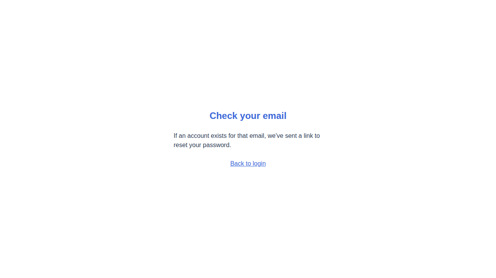
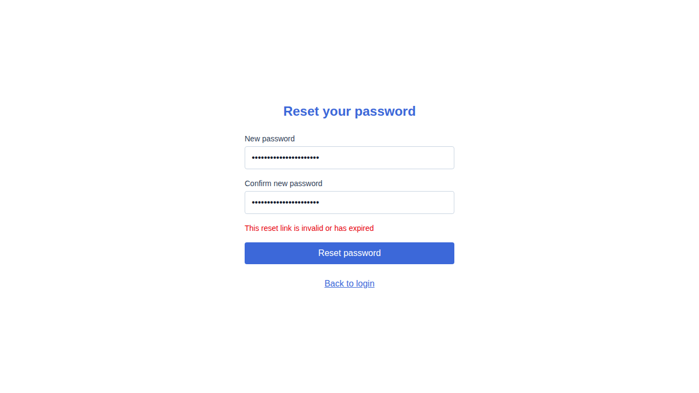
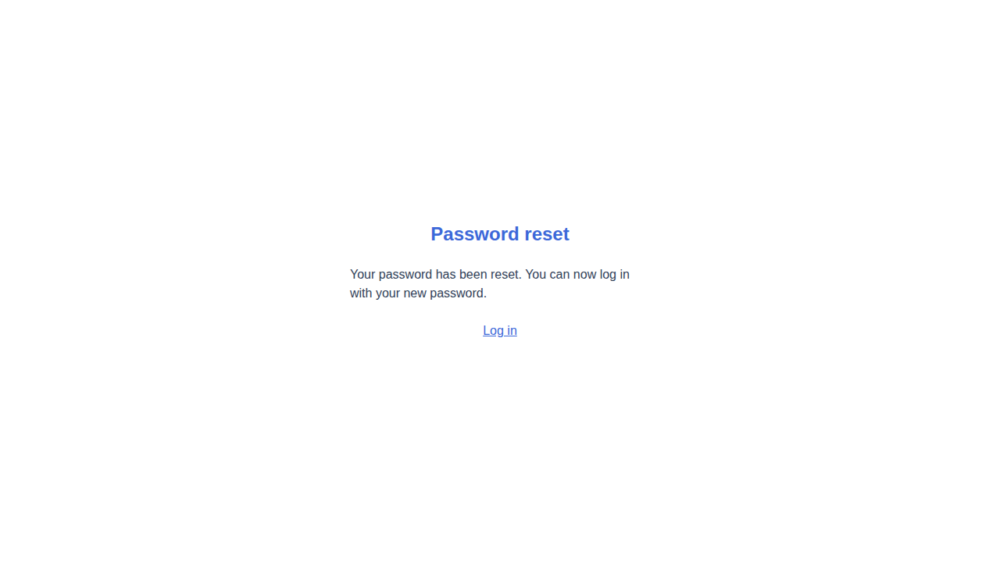
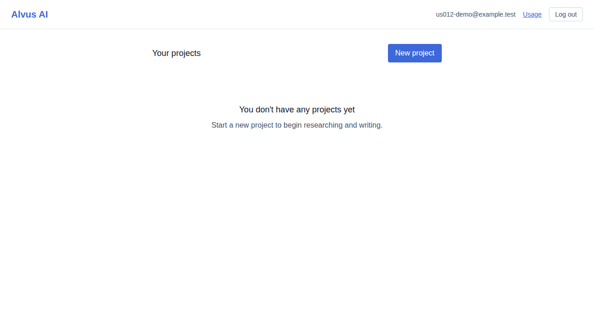

# US-012 — password reset flow

_Generated from this story's spec · 2026-08-10 · PASS_

## 1. Requesting a password reset shows a generic confirmation screen

## 2. An invalid reset token is rejected with a clear error

## 3. A valid reset token lets the user set a new password

## 4. Logging in with the new password reaches the app; the old password no longer works

