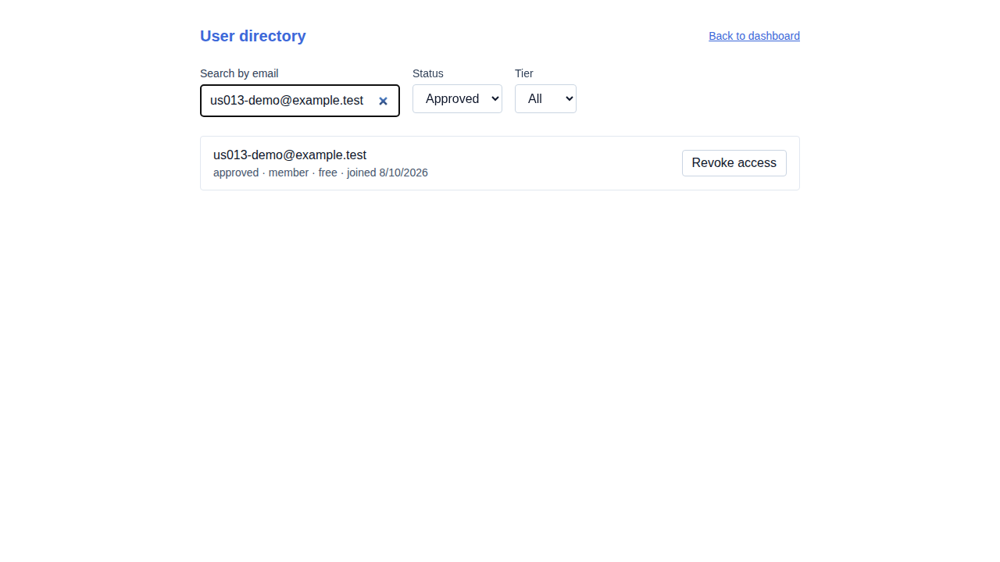
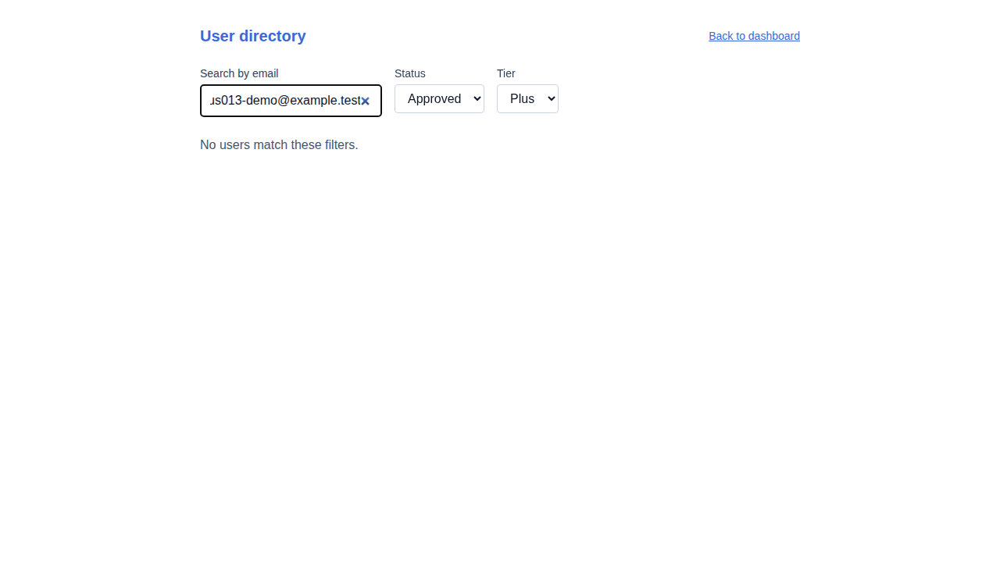
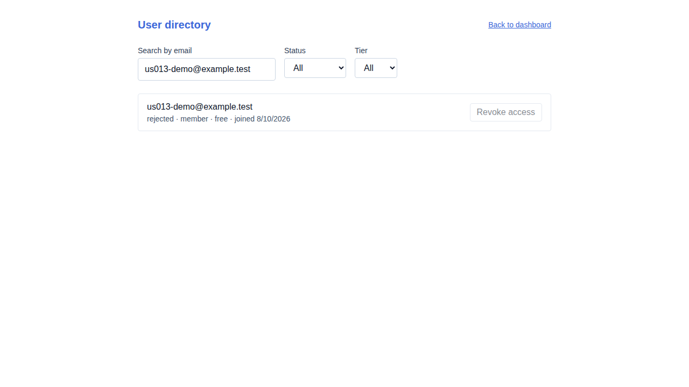

# US-013 — admin user directory

_Generated from this story's spec · 2026-08-10 · PASS_

## 1. The admin searches and filters the directory, and views the user's status, role, and tier

## 2. Filtering by a paid tier returns nobody -- no account can be on a paid plan before billing ships

## 3. The admin revokes the user's access; their status flips to rejected in the directory

