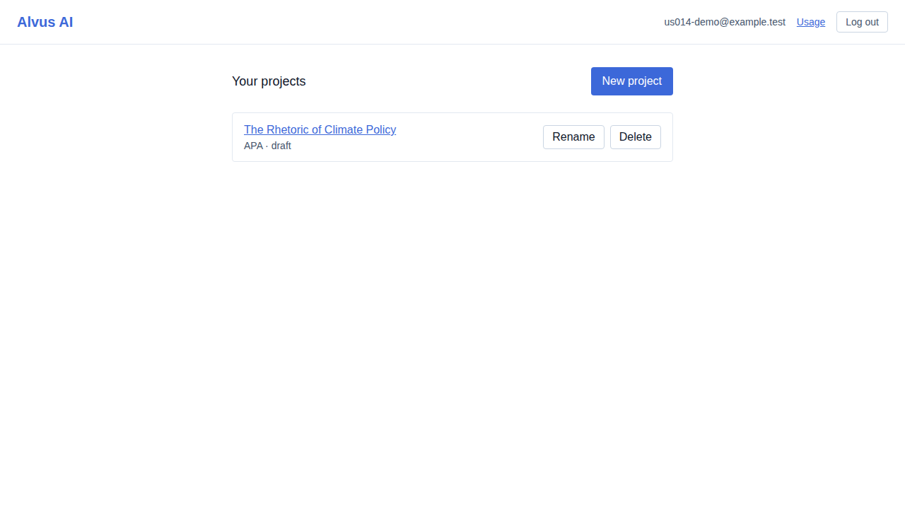
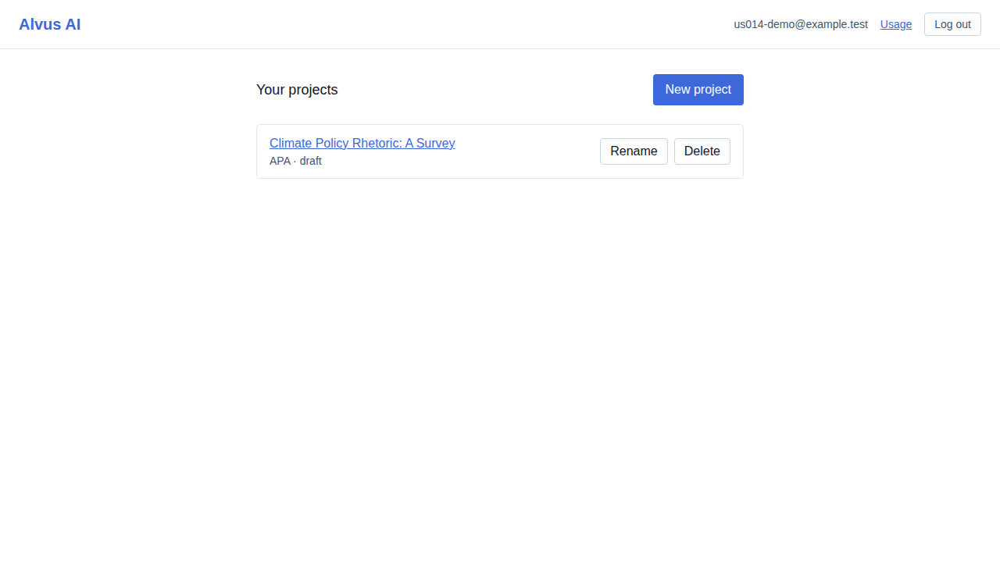
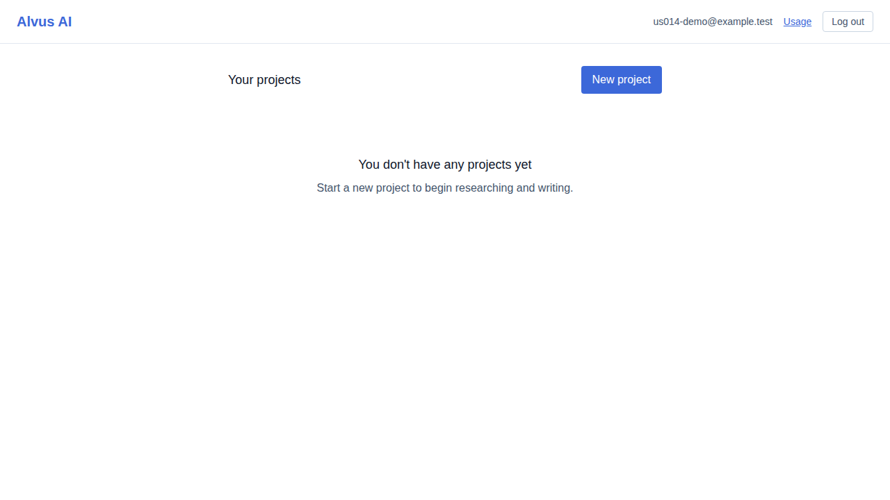

# US-014 — create, list, rename, and delete a project

_Generated from this story's spec · 2026-08-10 · PASS_

## 1. A newly-approved user sees the empty projects dashboard

## 2. The user creates a project with a title and citation format (APA)

## 3. The user renames the project; the citation format stays APA

## 4. Deleting requires confirmation; confirming removes the project and the empty state returns

