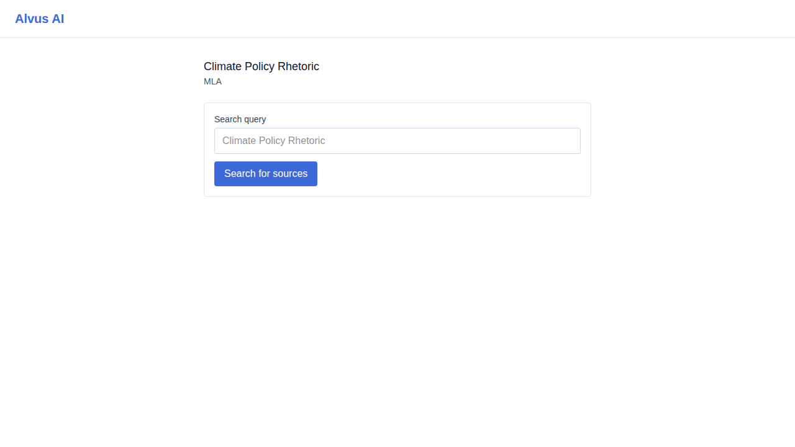
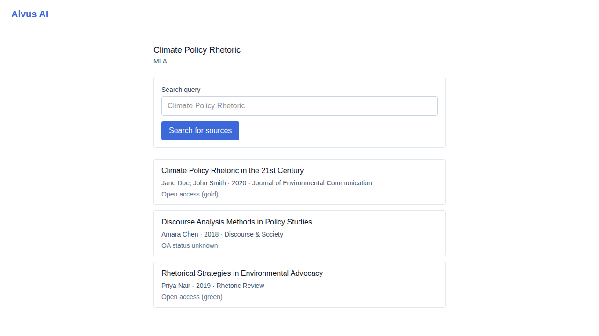
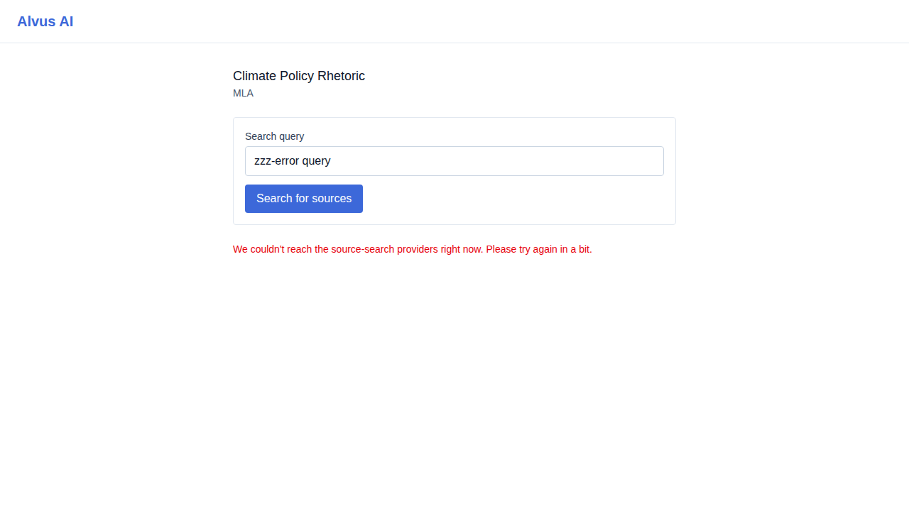

# US-015 — source discovery search

_Generated from this story's spec · 2026-08-09 · PASS_

## 1. Opening a project shows its source-discovery view

## 2. Searching returns candidate sources with title, authors, year, venue, and OA status

## 3. An empty result set shows a clear empty state offering the manual-upload path

## 4. An upstream provider outage shows a clear error state

