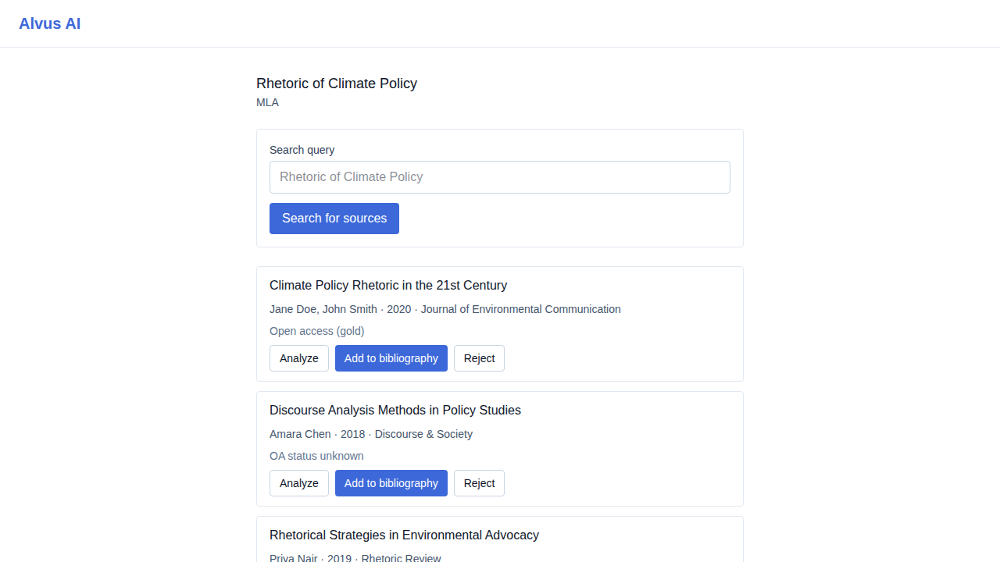
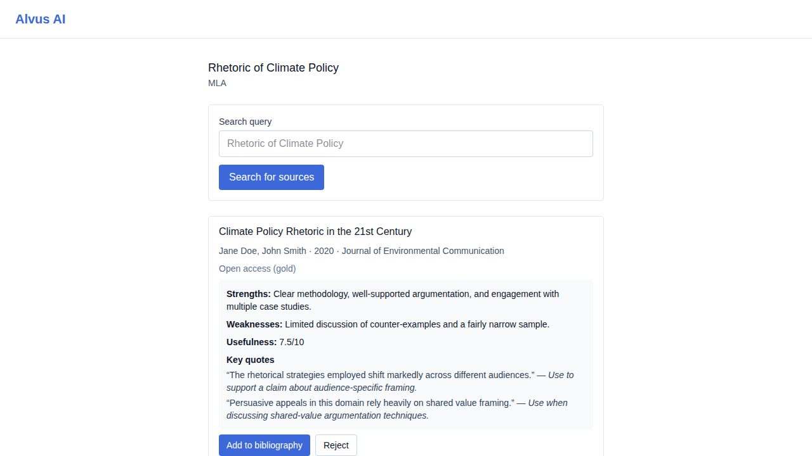
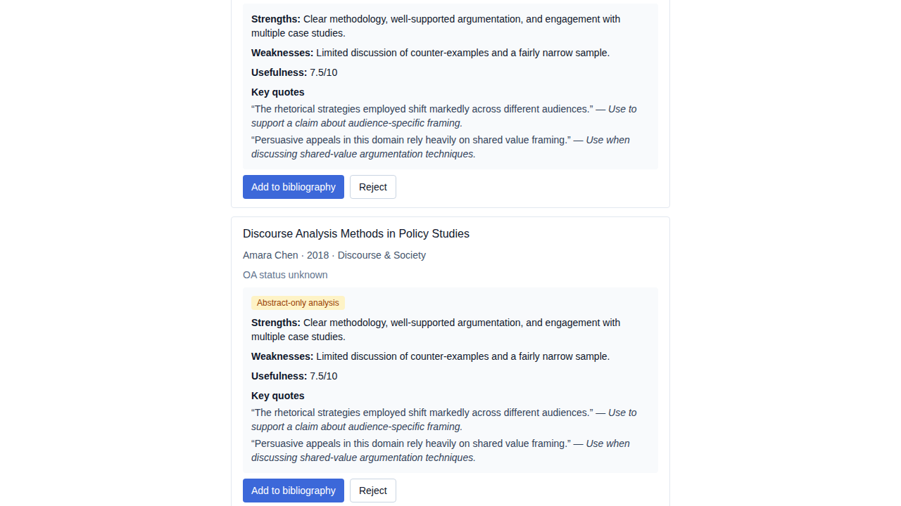
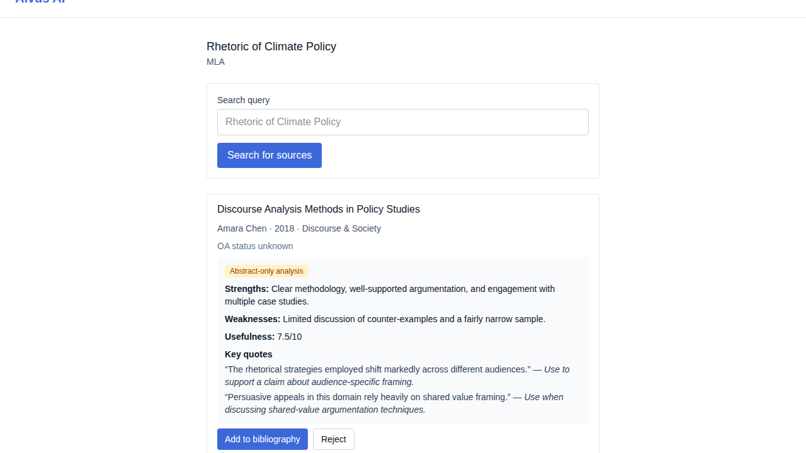
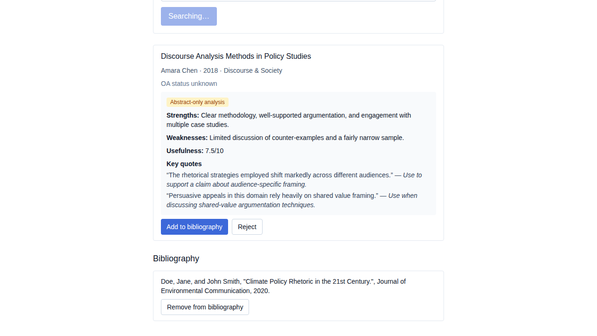
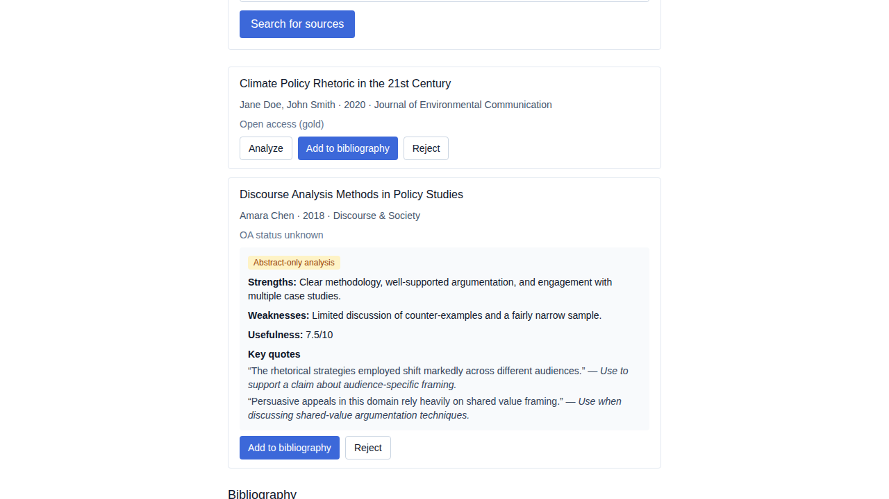
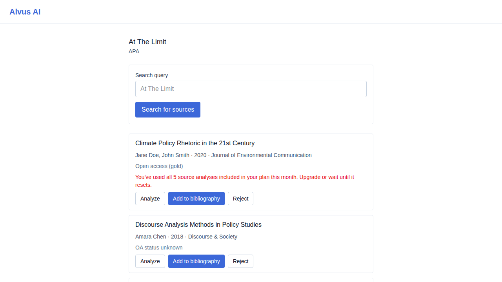

# US-016 — analyze a candidate source and select or reject it

_Generated from this story's spec · 2026-08-09 · PASS_

## 1. Searching returns candidate sources ready for AI analysis

## 2. Triggering AI analysis shows the generated citation, summary, usefulness score, and key quotes

## 3. A source lacking accessible full text is analyzed from its abstract and flagged as abstract-only

## 4. Selecting an analyzed source adds it to the project bibliography

## 5. Rejecting a candidate keeps it from reappearing on a later search

## 6. Deselecting a source removes it from the bibliography and returns it to the candidate pool

## 7. Analysis is blocked with a clear limit-reached message once the tier quota is exhausted

