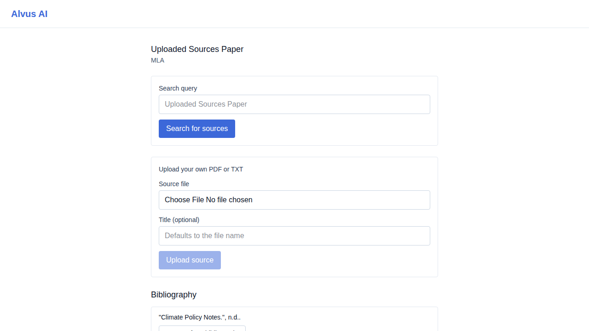
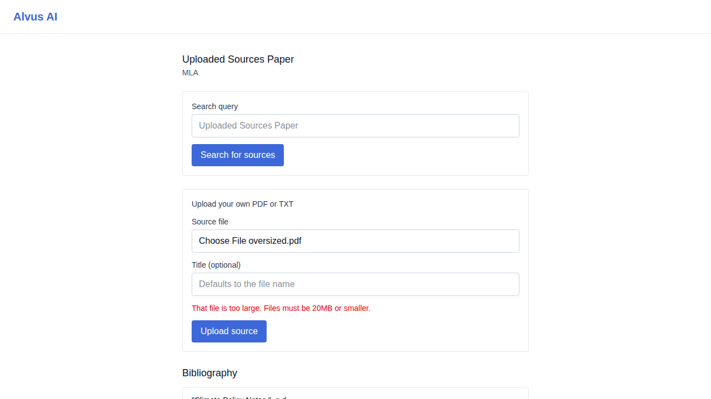
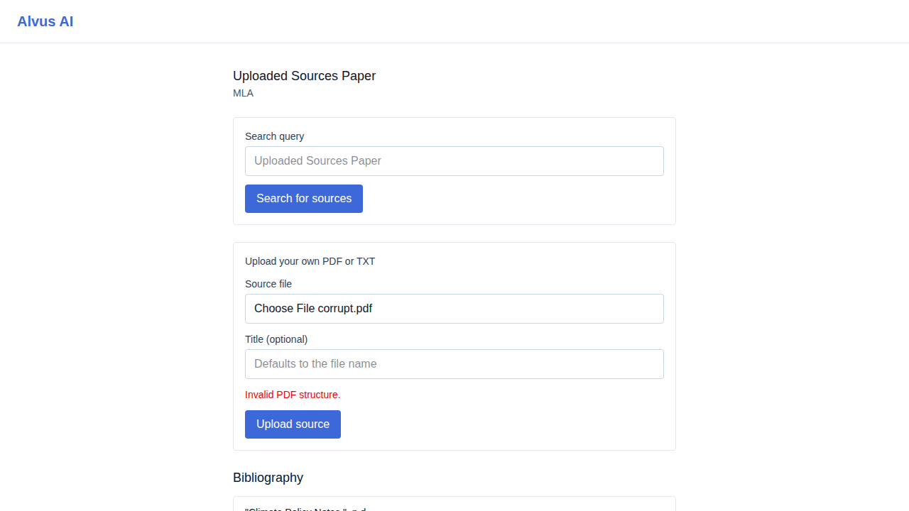
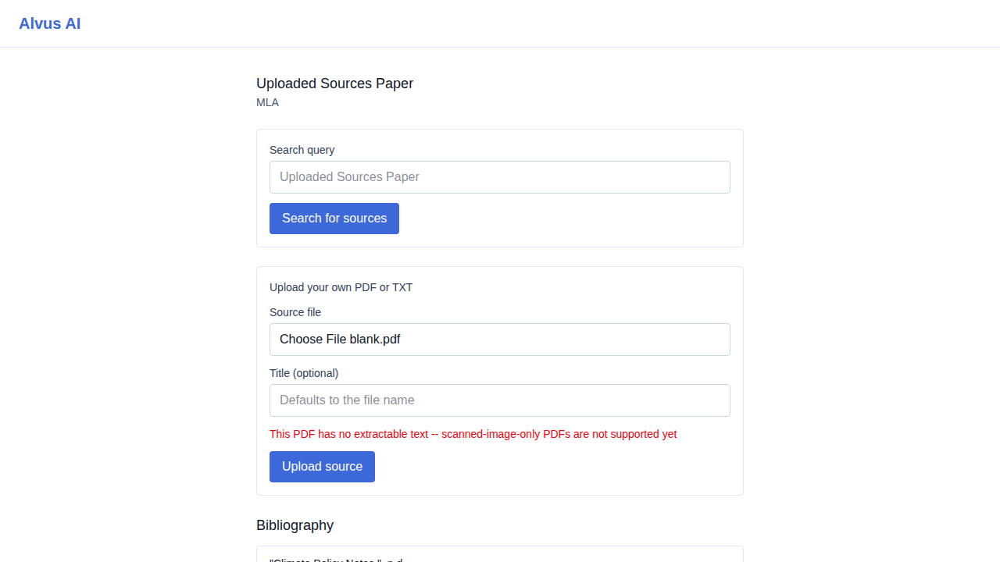

# US-017 — upload your own PDF/TXT source

_Generated from this story's spec · 2026-08-10 · PASS_

## 1. Uploading a PDF is analyzed automatically and added straight to the bibliography

## 2. A TXT upload with no title given falls back to the file name

## 3. An unsupported file type is rejected with a clear error

## 4. An oversized file is rejected with a clear error

## 5. A corrupted PDF fails gracefully with a clear error instead of crashing

## 6. A scanned-image-only PDF is flagged as having no extractable text, not silently analyzed empty

