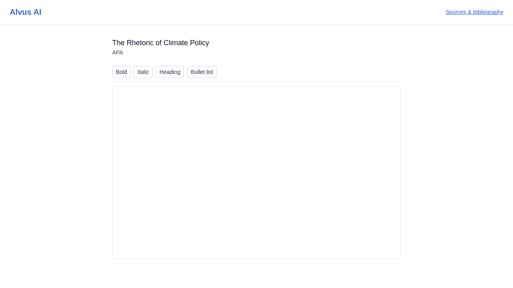
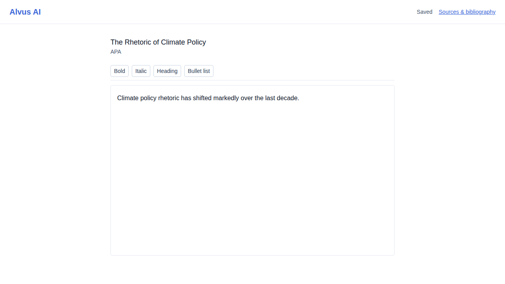
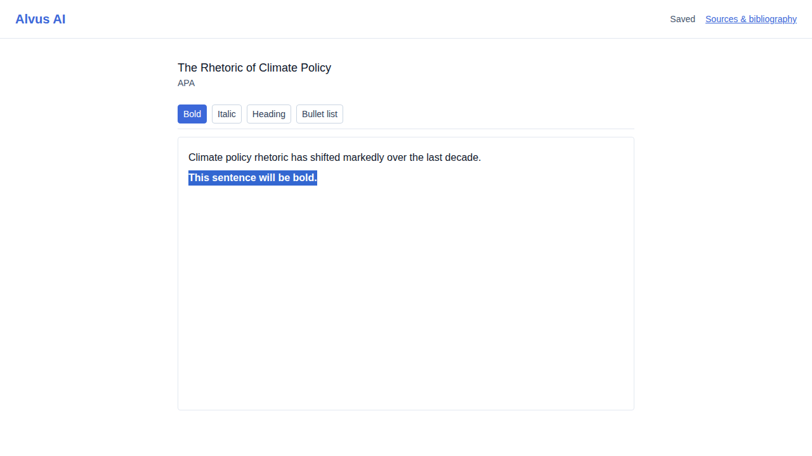
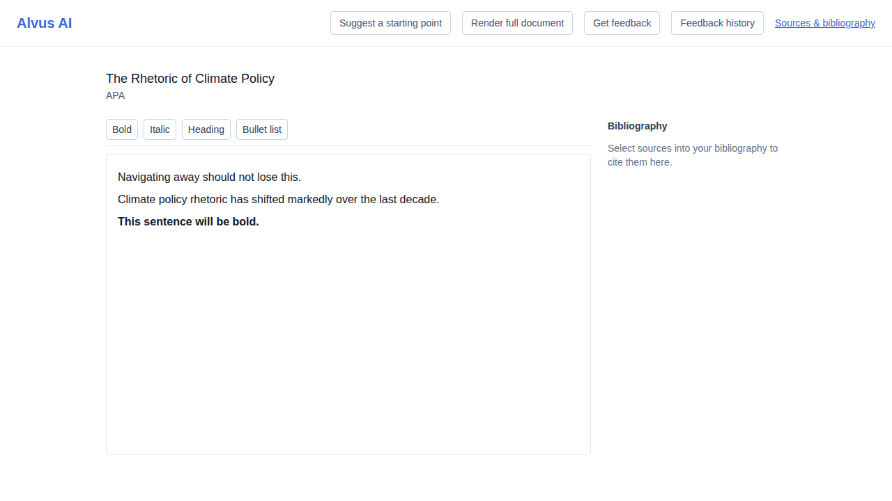

# US-018 — load, edit, and autosave a document in the editor

_Generated from this story's spec · 2026-08-11 · PASS_

## 1. Opening a project loads an empty document into the rich text editor

## 2. Typing in the editor triggers an autosave with no explicit save action

## 3. Formatting text as bold through the toolbar autosaves the change

## 4. Navigating away right after an edit still flushes the pending autosave

## 5. Reloading the page loads the autosaved document back into the editor

