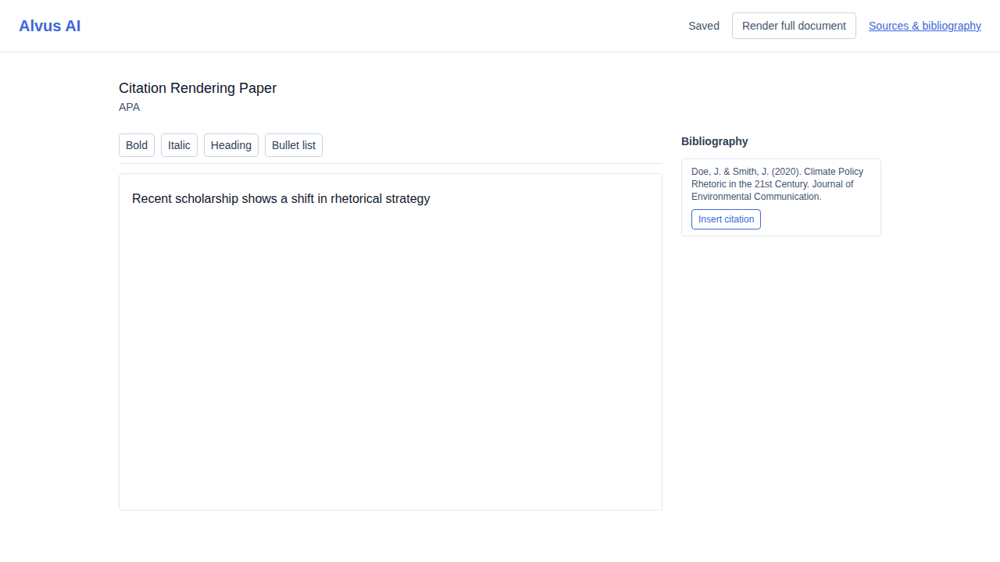
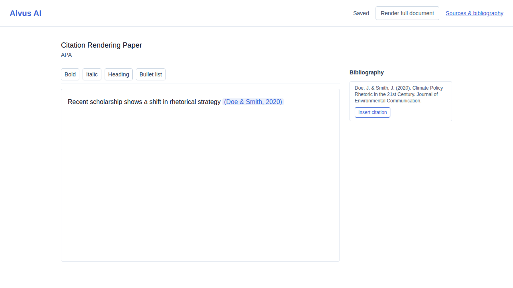
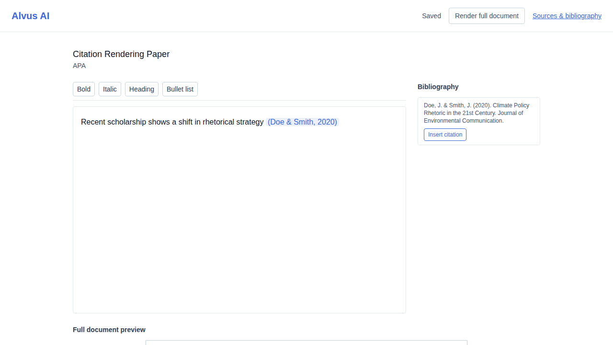
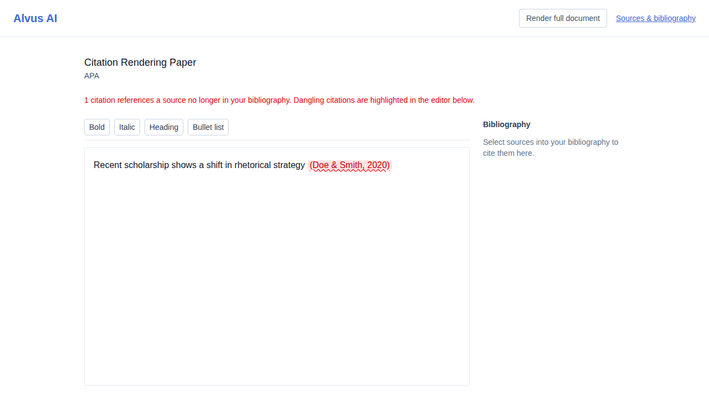

# US-019 — citation-format rendering: in-text citations, full-document re-render, dangling-citation detection

_Generated from this story's spec · 2026-08-11 · PASS_

## 1. The writing view shows the bibliography sidebar alongside the editor

## 2. Inserting a citation from the bibliography renders it correctly formatted for the project's APA style

## 3. Triggering a full re-render assembles the complete formatted paper with headers, margins, and a bibliography page

## 4. A re-render flags the in-text citation whose source is no longer in the bibliography as dangling

