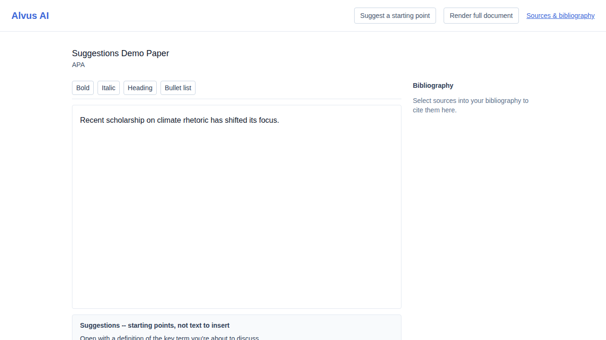
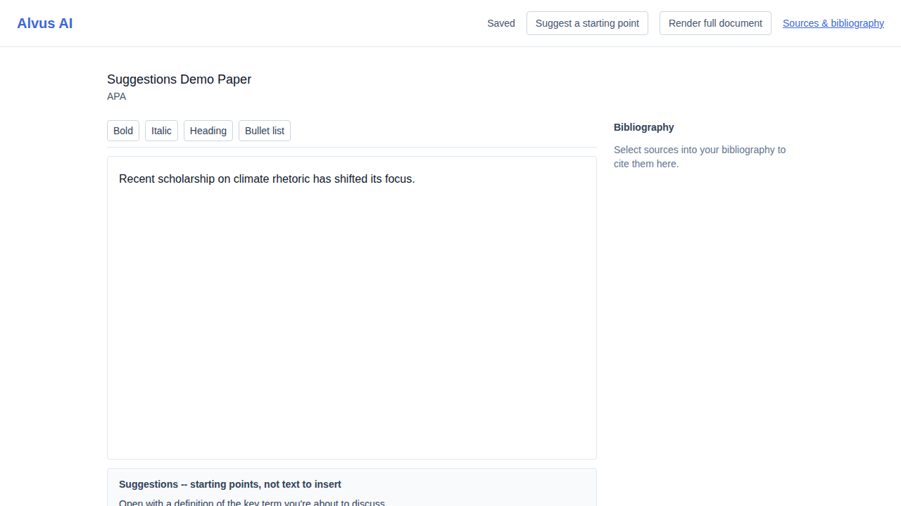

# US-020 — paragraph and structure suggestions in the editor

_Generated from this story's spec · 2026-08-13 · PASS_

## 1. Requesting a suggestion while writing shows an inline hint near the editor, never inserted into the document

## 2. Repeating the request well past the free tier's metered-action limit still succeeds -- suggestions are not metered

## 3. A rapid burst of repeated requests is throttled with a clear 429 rate-limit response, not silently dropped

