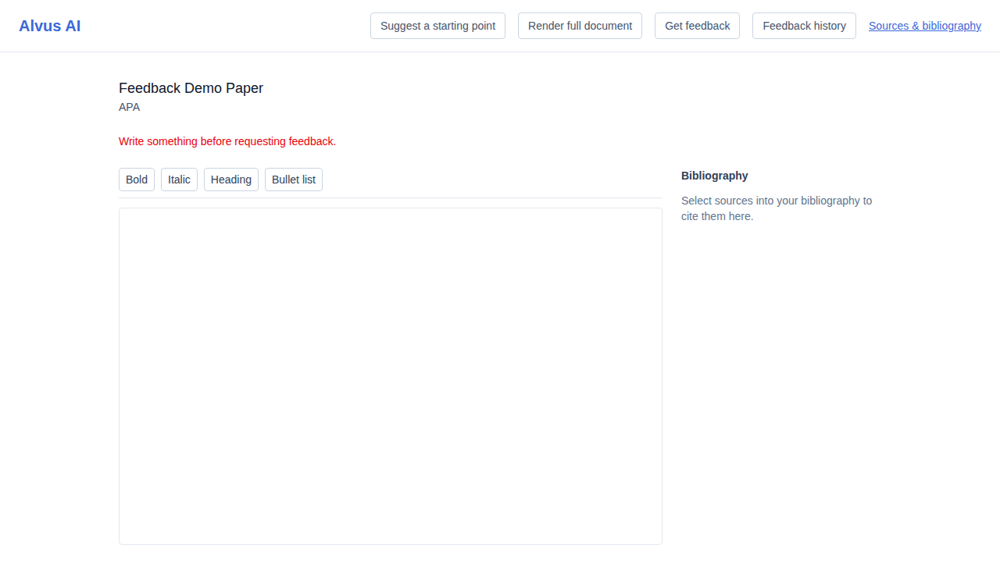
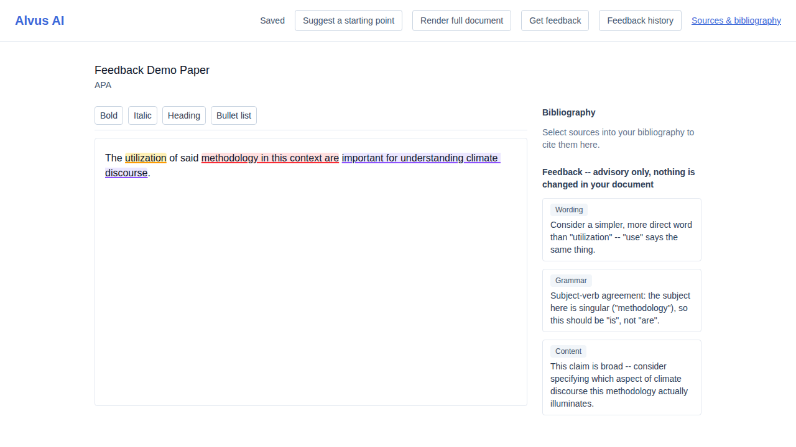
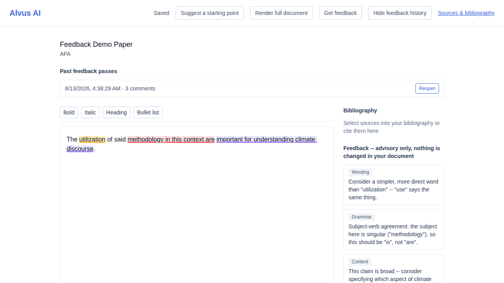

# US-021 — post-writing feedback pass

_Generated from this story's spec · 2026-08-13 · PASS_

## 1. Requesting a feedback pass on an empty document returns a clear error, not an empty pass

## 2. A feedback pass surfaces wording/grammar/content comments as margin annotations anchored to the draft, without changing the document

## 3. Past feedback passes are listed in the project history and can be reopened

## 4. Once the free tier's monthly feedback-pass limit is reached, requesting another pass is blocked with a clear limit-reached response

