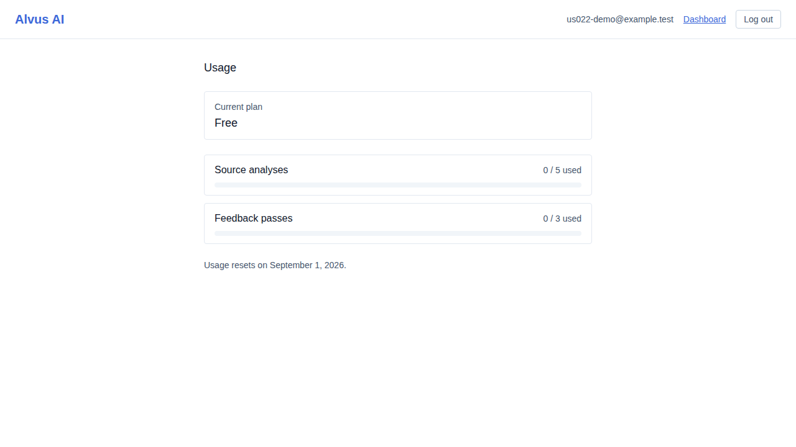
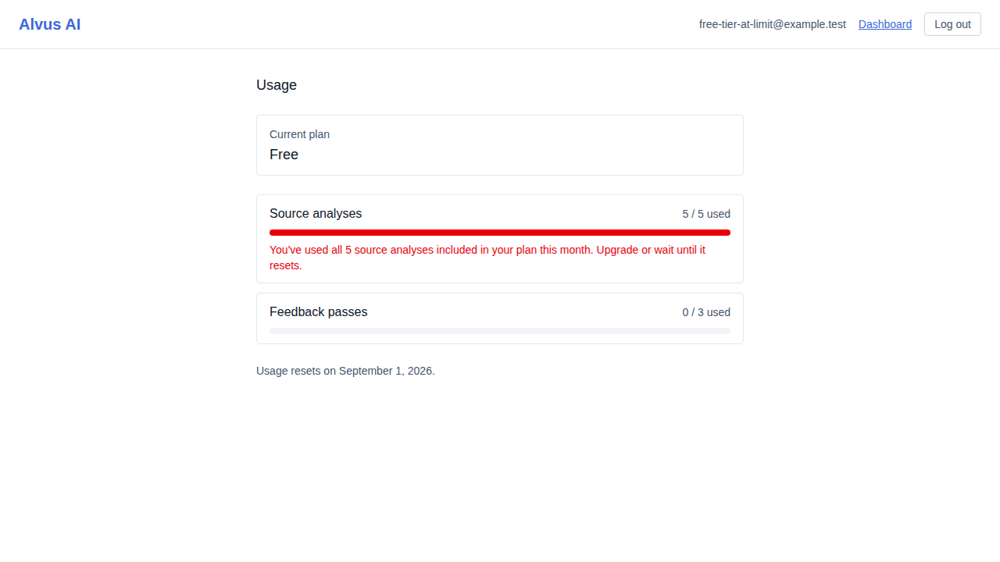

# US-022 — usage dashboard and limit-exceeded UX

_Generated from this story's spec · 2026-08-13 · PASS_

## 1. The usage dashboard shows the account's plan tier and usage against each metered action's monthly limit

## 2. Once a metered action's monthly limit is exhausted, the dashboard shows a clear upgrade-or-wait message instead of a generic error

