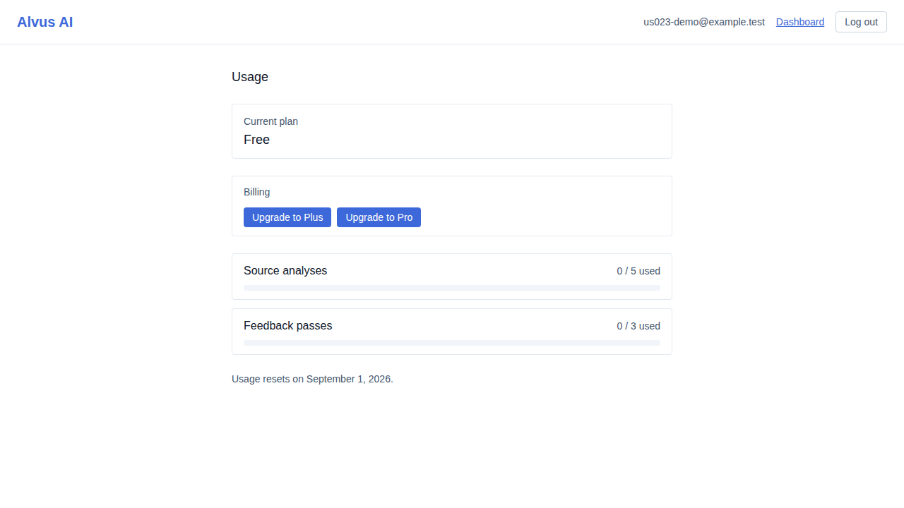
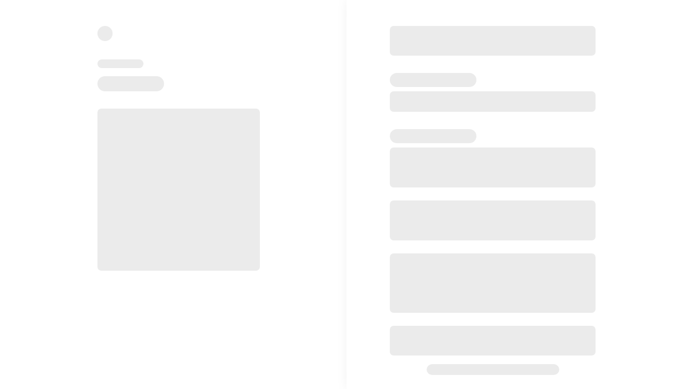
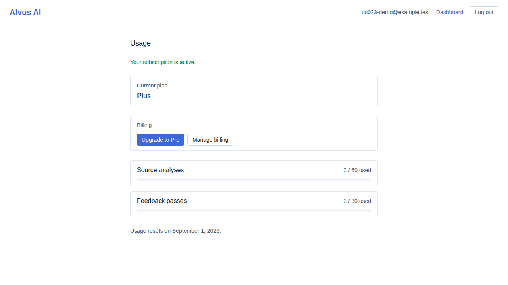

# US-023 — Stripe Checkout and Billing Portal

_Generated from this story's spec · 2026-08-15 · PASS_

## 1. A free-tier account sees an upgrade option for each paid plan and no billing-portal link yet

## 2. Upgrading redirects to a real Stripe test-mode Checkout session

## 3. Completing Checkout with Stripe's test card returns to the app with the account upgraded to Plus

## 4. Starting a duplicate Checkout for the plan already active on the account is rejected with a clear error

## 5. An existing subscriber can open the real Stripe Billing Portal to manage or cancel their plan

