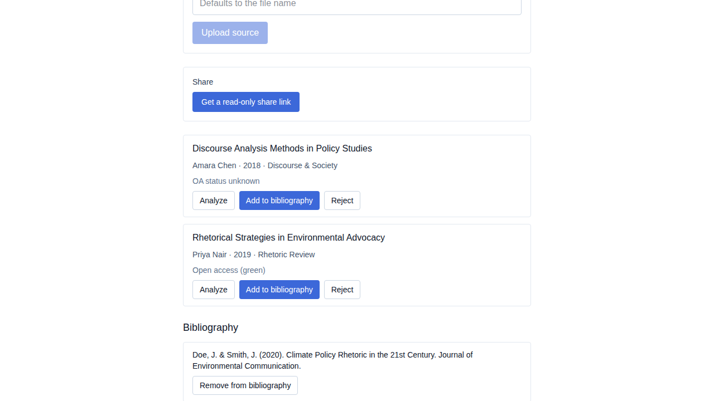
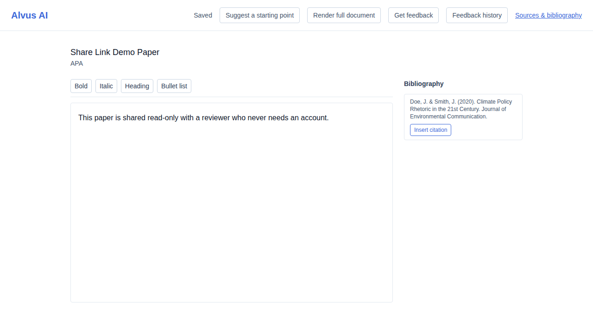
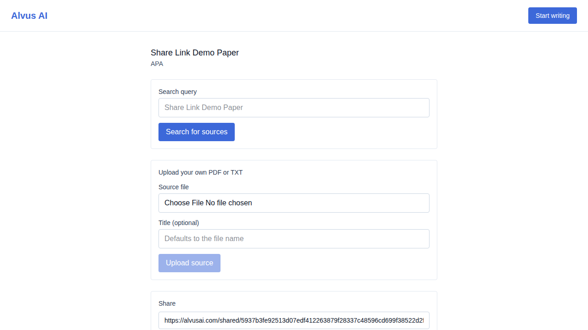
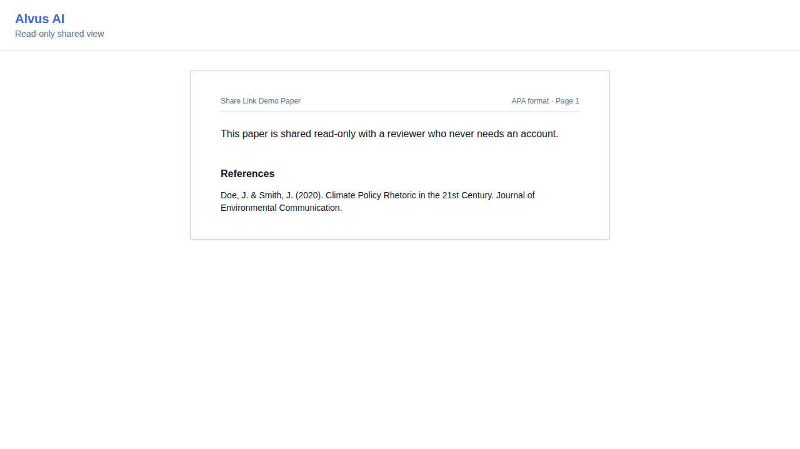
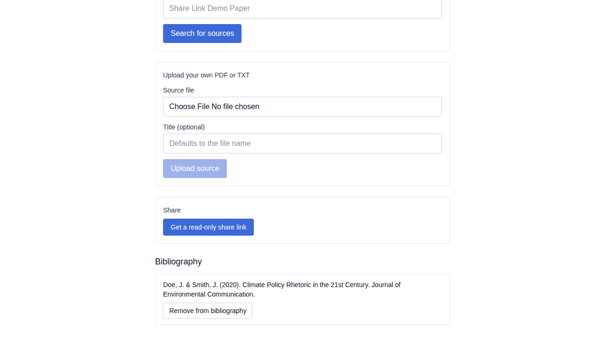
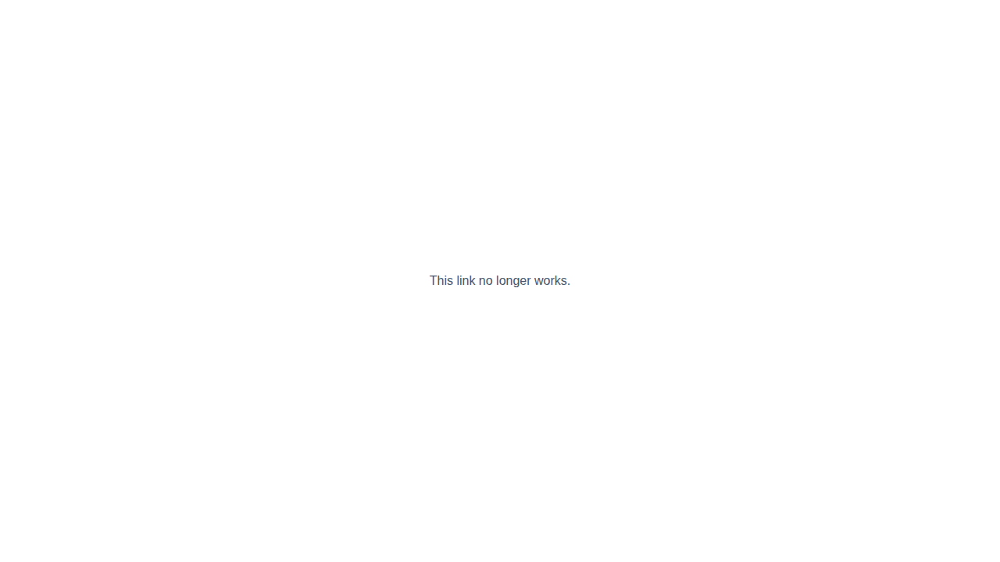

# US-025 — read-only share link

_Generated from this story's spec · 2026-08-14 · PASS_

## 1. The owner creates a project and selects a source into the bibliography

## 2. The owner writes a short draft, which autosaves before navigating away

## 3. The owner generates a read-only share link for the project

## 4. A visitor with no account or login sees the shared paper read-only, with no editing controls

## 5. The owner revokes the share link

## 6. Revoking the link (or visiting an unknown token) shows a clear "no longer works" state instead of an error or the owner's data

