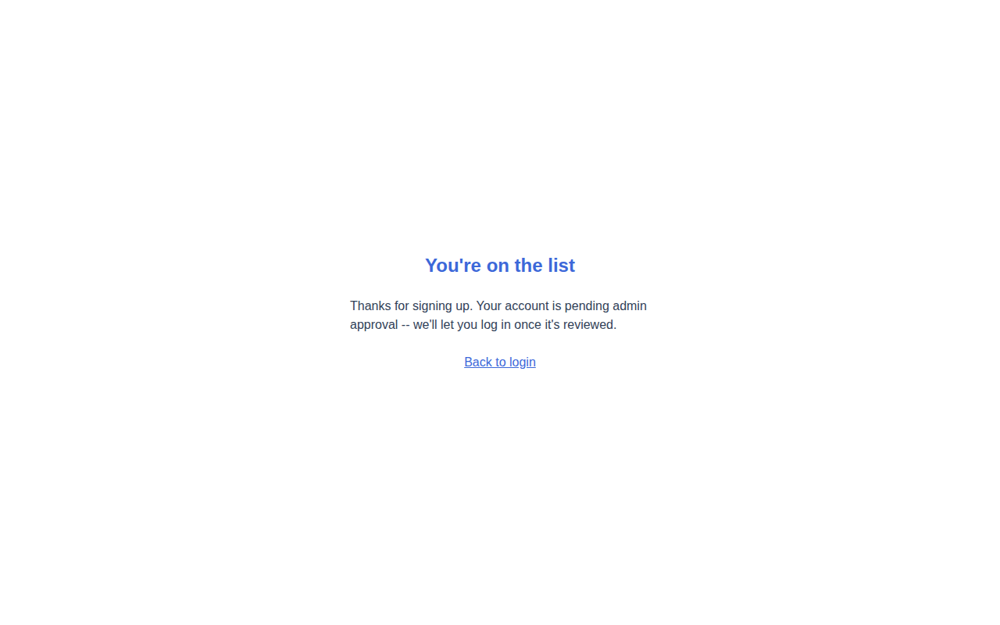
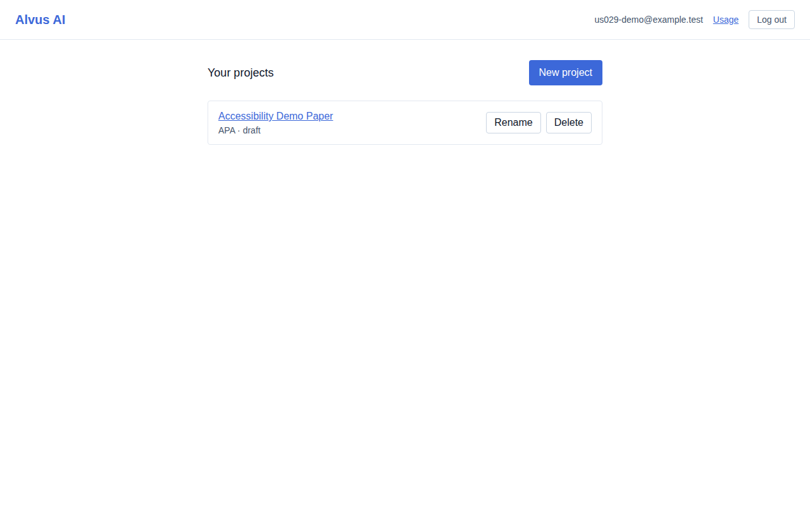
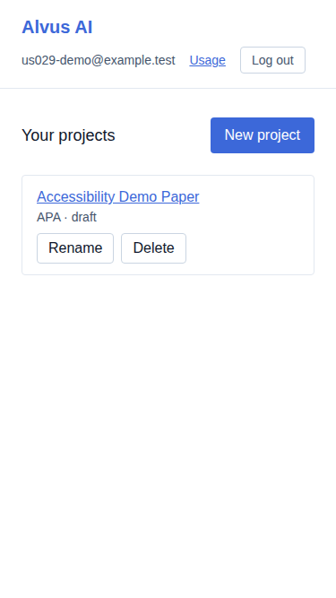
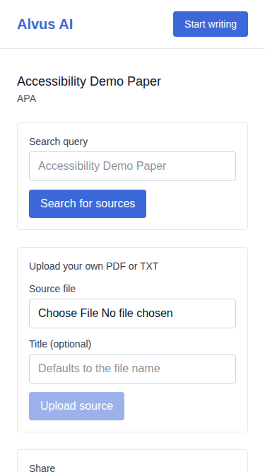
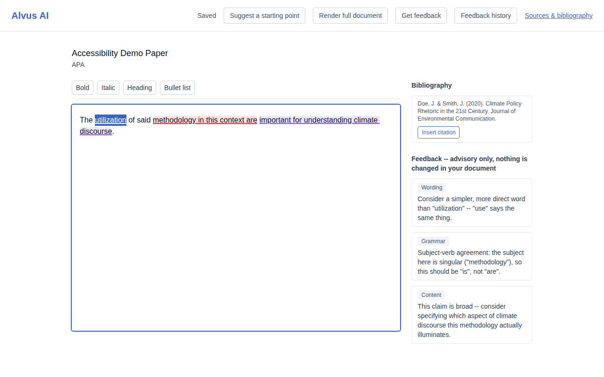
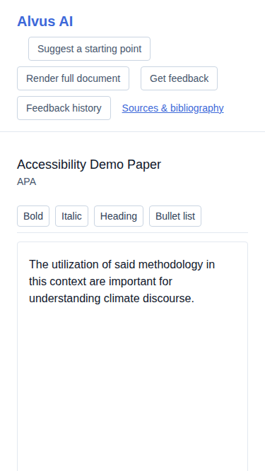
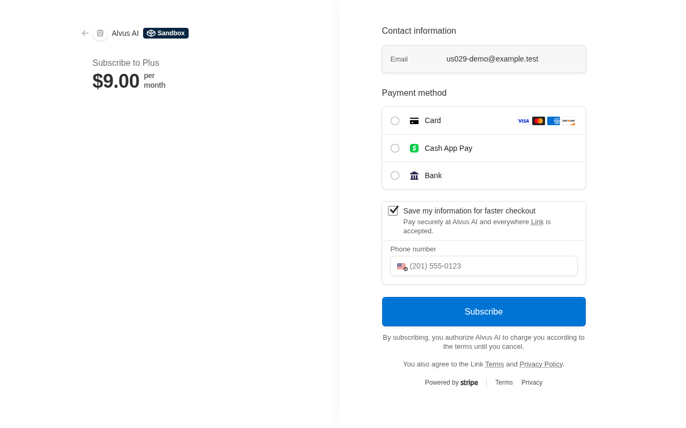
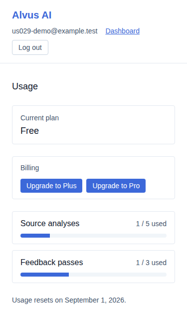

# US-029 — accessibility and responsive-layout hardening

_Generated from this story's spec · 2026-08-30 · PASS_

## 1. Signup is completable via keyboard alone, with a visible focus indicator at every stop and no accessibility violations

## 2. A project is created via keyboard alone: Tab reaches "New project" and every form field in order, Enter submits

## 3. The dashboard renders usably at a mobile viewport width, with no horizontal scrolling

## 4. Searching, analyzing, and selecting a source into the bibliography are all keyboard-operable, with no accessibility violations

## 5. The source review page renders usably at a mobile viewport width, with no horizontal scrolling

## 6. The editor has a visible focus indicator, and requesting/reading feedback comments is keyboard-operable, with no accessibility violations

## 7. The editor and its bibliography/feedback sidebar stack usably at a mobile viewport width, with no horizontal scrolling

## 8. The checkout entry point is keyboard-operable: Enter on the upgrade button launches real Stripe Checkout, with no accessibility violations on the usage page

## 9. The usage/checkout page renders usably at a mobile viewport width, with no horizontal scrolling

